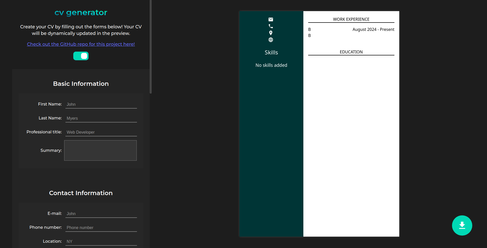
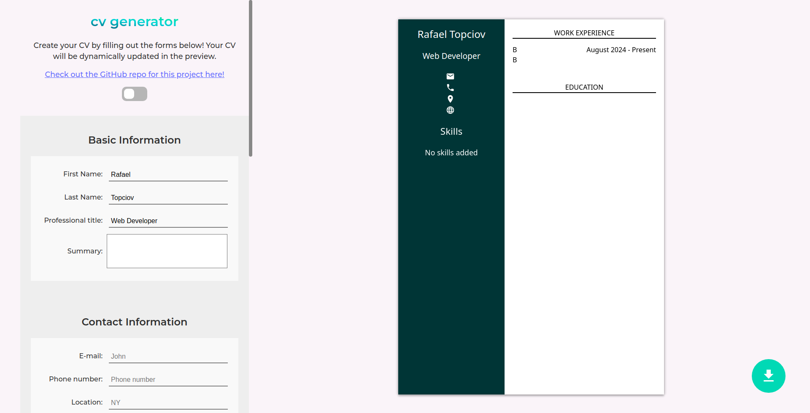

# Project: CV Generator

[**Live version** of the site can be found here](https://cv-generator-blond.vercel.app)

This CV Generator is a web application that allows users to create professional-looking CV's with ease. It is perfect for job seekers who want to stand out from the crowd and showcase their skills, experience, and achievements. Simply fill out the form in the app and the CV will be updated instantly.

Features:

1. User-friendly interface that makes it easy to create a custom CV

2. Add and edit sections such as basic information, contact information, education background, work experience, skills

3. Preview your CV at any time to make sure it looks presentable and fitting to your needs

4. Responsive design that allows you to create a CV even through your phone

### Built With

- Vite + React
- HTML5
- CSS

### Getting Started

In order to setup and work on this project on your own, you will need to:

1. Clone this project:  
   `git clone https://github.com/topciovrafael/cv-generator.git`

2. Once you have cloned this project, you can install the required dependencies by using:  
   `npm install`

3. A live demo of the project can be started by using:  
   `npm run preview`

4. Distribution files can be produced using:  
   `npm run build`

### Display

CV Generator on dark mode

CV Generator on light mode

---

Developed by **Topciov Rafael**
